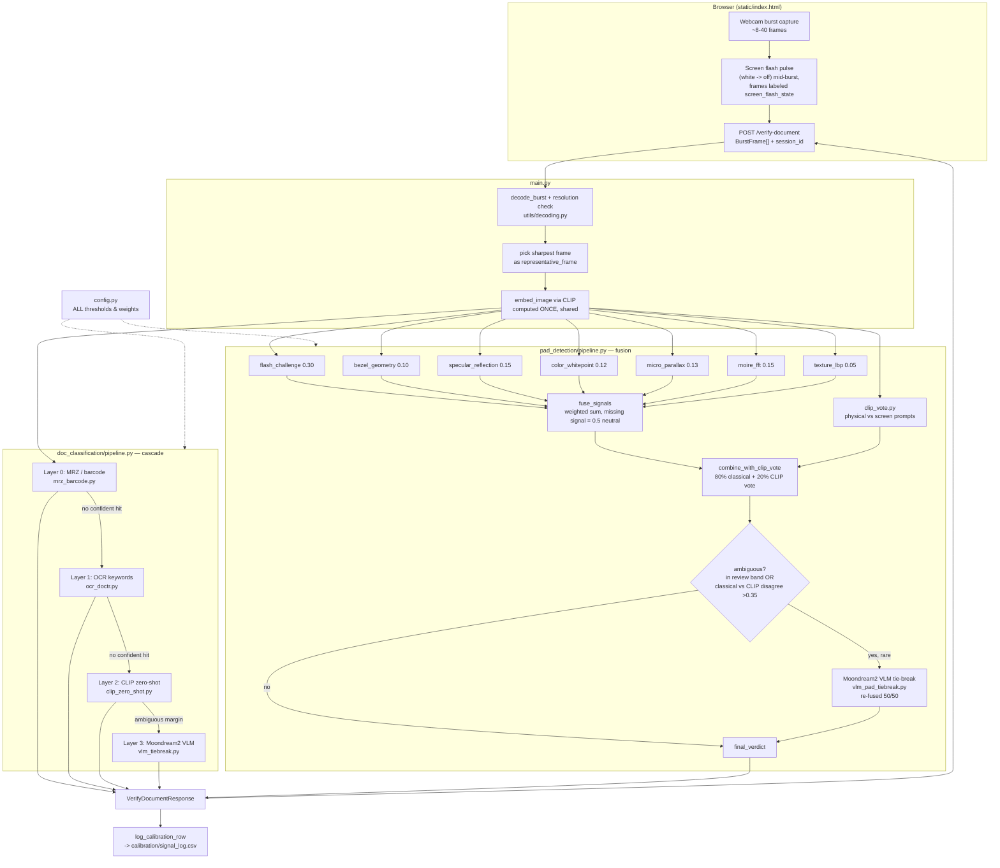

# ID Document Verification — Document Type + Presentation Attack Detection

A FastAPI service that takes a short webcam burst of someone holding up an ID document and answers two questions at once:

1. **What type of document is it?** (passport, driver's license, national ID, or open-ended "other") — with no fixed/closed class list.
2. **Is it real?** i.e. **Presentation Attack Detection (PAD)** — is the camera looking at a physical document, or a photo/screen recapture of one held up to fake it.

No custom-trained models and no dataset-building required to get started — everything runs on pretrained open-source weights (OpenCLIP, docTR, Moondream2) plus classical computer vision, fused together with an explicit **"don't guess, escalate to human review"** policy for anything ambiguous.

---

## 1. Design philosophy: cascade from cheapest+most-certain to slowest+most-flexible

This mirrors how production KYC systems (Onfido/Jumio/Veriff-style) are actually built: run deterministic checks first, spend ML only where nothing deterministic exists, and always allow the system to abstain to manual review rather than force a wrong answer under uncertainty.

**Document type** resolves through up to 4 layers, each a fallback for the one above:

| Layer | Method | Certainty | Speed |
|---|---|---|---|
| 0 | MRZ (`passporteye`) + PDF417 barcode (`zxing-cpp`) | Near-deterministic, checksum-validated | ~50-150ms |
| 1 | OCR keyword match (`docTR`) | Heuristic but strong | ~100-300ms |
| 2 | CLIP zero-shot (`open_clip`, `ViT-B-32` / `laion2b_s34b_b79k`) | Open-vocabulary | ~30-80ms (GPU) |
| 3 | Moondream2 VLM free-text tie-break | Rare fallback | ~1-2s |

**Presentation attack detection** fuses 7 independent classical CV signals (weighted sum) plus a CLIP zero-shot secondary vote, escalating to the same VLM only when genuinely ambiguous. This is deliberately an interpretable weighted fusion, not a single trained classifier — every verdict comes with which signals fired and why, it needs no labeled screen-recapture dataset to bootstrap, and it generalizes across phone/monitor models a narrow CNN wouldn't have seen.

Full signal-by-signal rationale (why moire is weighted low, why flash-challenge is the strongest signal, etc.) is already documented in the repo's own `README.md` — see Section 6 below for the summary table.

---

## 2. Architecture



### Module map

| Path | Responsibility |
|---|---|
| `main.py` | FastAPI app, single `POST /verify-document` endpoint, `GET /health` |
| `config.py` | Every threshold/weight/model name — the only file you touch when calibrating |
| `schemas.py` | Pydantic request/response contracts |
| `doc_classification/mrz_barcode.py` | Layer 0 — deterministic MRZ + AAMVA barcode parsing |
| `doc_classification/ocr_doctr.py` | Layer 1 — docTR OCR keyword matching |
| `doc_classification/clip_zero_shot.py` | Layer 2 — open-vocabulary CLIP zero-shot classification |
| `doc_classification/vlm_tiebreak.py` | Layer 3 — Moondream2 free-text fallback (lazy-loaded) |
| `doc_classification/pipeline.py` | Cascades layers 0→3, picks the sharpest frame for OCR/MRZ |
| `pad_detection/flash_challenge.py` | Signal: correlates brightness change with the client's own screen-flash pulse |
| `pad_detection/bezel_geometry.py` | Signal: Hough-line search for a second bezel edge around the document |
| `pad_detection/specular_reflection.py` | Signal: glare sharpness/size (glass vs. paper/PVC) |
| `pad_detection/color_whitepoint.py` | Signal: color temperature/saturation (emissive display vs. reflected light) |
| `pad_detection/micro_parallax.py` | Signal: Lucas-Kanade optical flow + planar-homography residual |
| `pad_detection/moire_fft.py` | Signal: FFT moire detection (low weight, bonus only) |
| `pad_detection/texture_lbp.py` | Signal: LBP texture uniformity (low weight) |
| `pad_detection/clip_vote.py` | CLIP zero-shot secondary vote (reuses the shared embedding) |
| `pad_detection/vlm_pad_tiebreak.py` | Wraps the shared Moondream2 model for the PAD ambiguous case |
| `pad_detection/fusion.py` | Weighted fusion, escalation logic, PASS/FAIL/MANUAL_REVIEW decision bands |
| `pad_detection/pipeline.py` | Orchestrates all 7 signals + CLIP vote + optional VLM tie-break |
| `utils/decoding.py` | Base64 → burst frames, strict error handling, resolution consistency check |
| `utils/clip_engine.py` | Shared OpenCLIP loader/embedder (used by both doc-type and PAD pipelines) |
| `utils/timing.py` | Per-stage latency tracking, surfaced in the API response |
| `utils/logging_calibration.py` | Logs every raw signal score + verdict to CSV per request |
| `calibration/review_calibration.py` | Compares signal score separation between known-physical vs. known-screen sessions |
| `calibration/signal_log.csv` | Accumulated calibration log (already contains sample rows from prior test runs) |
| `static/index.html` | Standalone webcam burst-capture test page (fires the flash pulse client-side) |

---

## 3. How a request flows through the system

1. **Client** captures a burst (`MIN_BURST_FRAMES=8` to `MAX_BURST_FRAMES=40`) via `static/index.html`, firing a brief white→off flash on its own screen partway through and labeling each frame's `screen_flash_state`.
2. **`POST /verify-document`** decodes and validates the burst (consistent resolution enforced), then picks the **sharpest frame** (highest Laplacian variance) as the `representative_frame` used everywhere a single frame is needed.
3. A **single CLIP embedding** is computed on that representative frame and shared between document-type classification (layer 2) and the PAD CLIP vote — the biggest latency win in the pipeline, since CLIP is otherwise called twice per request.
4. **Document type** cascades through layers 0→3, stopping at the first confident layer.
5. **PAD** runs all 7 classical signals against the burst/representative frame, fuses them into a `classical_fusion_score` (missing/unfired signals contribute a neutral 0.5 rather than pulling the score toward either verdict), blends in the CLIP vote at 20% weight, and — only if the result is still ambiguous or the two sub-scores disagree by >0.35 — escalates once to the VLM tie-break.
6. Final PAD verdict is banded: `fused_score >= 0.68 → physical`, `<= 0.37 → screen_recapture`, otherwise `manual_review`. **Never a forced guess.**
7. Every raw signal score, the fused score, verdict, and doc type are appended to `calibration/signal_log.csv` for later threshold tuning.
8. Response returns both results plus per-stage timing in milliseconds.

---

## 4. API

### `POST /verify-document`

Request:
```json
{
  "session_id": "optional-client-supplied-id",
  "frames": [
    {
      "image_b64": "<base64 JPEG/PNG, data-URI prefix optional>",
      "timestamp_ms": 0,
      "screen_flash_state": "off"
    },
    { "image_b64": "...", "timestamp_ms": 110, "screen_flash_state": "white" }
  ]
}
```
- `frames` must contain between `MIN_BURST_FRAMES` (8) and `MAX_BURST_FRAMES` (40) entries.
- `screen_flash_state` is `"off" | "white" | "unknown"` — used to correlate against the flash-challenge signal. If `config.FLASH_CHALLENGE_REQUIRED` is set to `True`, the request is rejected with a `400` unless both a `"white"` and an `"off"` labeled frame are present.

Response:
```json
{
  "session_id": "094e0087-e620-49ac-81e9-54ebc7de3145",
  "document": {
    "document_type": "national_id",
    "confidence": 0.8048,
    "source_layer": "clip_zero_shot",
    "raw_fields": { "all_scores": { "...": "..." } }
  },
  "presentation": {
    "verdict": "physical",
    "fused_score": 0.7748,
    "signals": [
      { "name": "flash_challenge", "score": 0.5137, "weight": 0.30, "fired": true, "detail": "..." },
      { "name": "bezel_geometry", "score": 0.8, "weight": 0.10, "fired": true, "detail": "..." }
    ],
    "clip_vote_score": 0.9999,
    "vlm_used": false,
    "vlm_reasoning": null
  },
  "stage_timings_ms": { "decode_burst": 4.1, "clip_embed_shared": 22.7, "...": "...", "total": 310.5 }
}
```

### `GET /health`
Returns `{"status": "ok"}`.

### `GET /static/index.html`
The webcam burst-capture demo page. Records the burst, fires the flash pulse, and posts to `/verify-document`.

---

## 5. Setup & running it

### System packages (required for Layer 0 — MRZ/barcode)
```bash
sudo apt update
sudo apt install -y tesseract-ocr libzbar0
```
On Windows, install Tesseract via the UB-Mannheim installer; `config.py` auto-detects it at `C:\Program Files\Tesseract-OCR\tesseract.exe` if present. Without these, layer 0's MRZ/barcode checks silently return `None` and the cascade falls through to OCR/CLIP — the app still works, just without the deterministic fast path.

### Python environment
```bash
python3 -m venv venv
source venv/bin/activate   # Windows: venv\Scripts\activate
pip install -r requirements.txt
```
Key packages: `fastapi`, `uvicorn[standard]`, `opencv-python-headless`, `passporteye` + `pytesseract` (MRZ), `zxing-cpp` (barcode), `python-doctr[torch]` (OCR), `open_clip_torch` + `torch`/`torchvision` (CLIP), `transformers`/`accelerate`/`einops` (Moondream2 VLM).

On first run, OpenCLIP, docTR, and the VLM each auto-download their pretrained weights (a few GB total: CLIP ViT-B/32 is small, docTR's models are moderate, Moondream2 is ~3.7GB in fp16). All open-weight — no API keys required.

By default the app tries `DEVICE=cuda` (env var `ID_VERIFY_DEVICE`) and falls back to CPU automatically if no GPU is available; expect layer 3 (VLM) and CLIP to be substantially slower on CPU.

### Run
```bash
uvicorn main:app --reload --host 0.0.0.0 --port 8000
```
Then open `http://localhost:8000/static/index.html` with webcam access, click **Capture Burst**, and the JSON result (doc type + PAD verdict + full signal breakdown) renders in the page.

---

## 6. Presentation-attack signal weights at a glance

| Signal | Weight | Why |
|---|---|---|
| `flash_challenge` | 0.30 | Strongest, PPI-independent — a physical document reflects the client's own screen-flash pulse; a screen-in-frame has its own backlight and doesn't correlate the same way |
| `bezel_geometry` | 0.10 | Purely geometric second-edge (device bezel) detection via Hough lines |
| `specular_reflection` | 0.15 | Glass produces small sharp glare; paper/PVC produces broader, softer highlights |
| `color_whitepoint` | 0.12 | Emissive displays run cooler/more saturated than reflected indoor light |
| `micro_parallax` | 0.13 | Optical-flow planarity residual — real 3D relief moves non-uniformly under hand tremor; a flat recapture doesn't. Supporting signal only (a steady hand or propped phone can suppress it) |
| `moire_fft` | 0.15 | FFT interference-pattern detection — intentionally not top-weighted, since modern high-PPI phone screens photographed at normal distance often don't alias into visible moire at all |
| `texture_lbp` | 0.05 | Low-weight bonus signal, LBP texture uniformity |

A signal that lacks enough evidence to fire contributes at **neutral (0.5)**, never a confident 0 or 1 — this stops a missing signal from silently dragging the fused score toward the wrong verdict. See the repo's own `README.md` for the full "why this architecture" writeup (it's more detailed than the summary above and worth reading before touching `config.PAD_SIGNAL_WEIGHTS`).

---

## 7. Calibration (no dataset needed — just your own test captures)

Every request appends its raw signal scores, `fused_score`, verdict, and doc-type result to `calibration/signal_log.csv` (already seeded with sample rows from prior runs). To (re)calibrate against your own hardware/lighting:

1. Run ~10-15 genuine physical-document captures through the UI, noting the returned `session_id`s.
2. Run ~10-15 deliberate screen-recapture attempts (hold a phone showing a photo of an ID up to the webcam) the same way.
3. ```bash
   python calibration/review_calibration.py \
     --known-physical-sessions <id1>,<id2>,... \
     --known-screen-sessions <id3>,<id4>,...
   ```
   This prints per-signal mean separation between the two groups.
4. Signals with weak separation → lower their weight in `config.PAD_SIGNAL_WEIGHTS`; signals with strong, consistent separation → raise it. Adjust `PAD_PASS_THRESHOLD` / `PAD_FAIL_THRESHOLD` based on where the two groups' `fused_score` distributions actually land.

This is calibration (tuning a handful of numbers against your own reference captures), not dataset-building or model training.

---

## 8. limitations

- **`micro_parallax`** can be suppressed by a very steady hand or a propped-up phone — a supporting signal only, never decisive alone.
- **`moire_fft`** frequently shows nothing on modern high-PPI phone screens at normal capture distance — expected, by design low-weight.
- **`flash_challenge`** depends on the client actually rendering the flash pulse and correctly labeling `screen_flash_state`; if it can't (constrained browser environment), this signal reports "not fired" and the system leans on the other six.
- **Layer 0 (MRZ/barcode)** requires `tesseract-ocr` and `libzbar0` system packages; without them it returns `None` and the cascade falls through, still working but without the deterministic fast path.
- All thresholds in `config.py` are reasonable starting points, **not final** — run the calibration pass in Section 7 against your own webcam/lighting setup before trusting this in a real verification flow.
- The VLM tie-break (Moondream2) is lazy-loaded on first use, so the very first ambiguous request in a fresh process will be noticeably slower while it loads into memory/VRAM.

## 9. Server Deployment & CI/CD Setup

This repository is configured for automated deployment to a dedicated server using Docker and GitHub Actions.

### Continuous Deployment (GitHub Actions)
An automated deployment pipeline is included in `.github/workflows/deploy.yml`[cite: 3]. To activate this CI/CD pipeline, the deployment team must add the following secrets to the GitHub repository settings (**Settings -> Secrets and variables -> Actions**):
* `SERVER_HOST`: The public IP address of the target server[cite: 3].
* `SERVER_USERNAME`: The SSH username (e.g., `ubuntu`)[cite: 3].
* `SERVER_SSH_KEY`: The private SSH key for server access[cite: 3].

Once these secrets are configured and the repository is initially cloned onto the server at `~/physical-vs-screen-id`, any pushes to the `main` branch will automatically pull the latest code, rebuild the Docker image, and restart the container[cite: 3]. *(Note: The GitHub Action will intentionally fail on push until these secrets are securely added).*

### Hardware Requirements
* **Memory (RAM):** The server should be provisioned with at least **8 GB of RAM**. To eliminate cold-start latency, the application eager-loads the Moondream2 VLM on server startup, which permanently occupies approximately 3.7 GB of memory[cite: 3]. 

### Docker & Model Caching
* **Port Mapping:** The provided `Dockerfile` exposes port `7860`[cite: 3]. 
* **Caching Model Weights:** The open-weight models (OpenCLIP, docTR, Moondream2) download automatically on the first run[cite: 3]. To prevent the server from redownloading gigabytes of data every time the container restarts, it is strictly recommended to mount a persistent volume for the Hugging Face cache.

**Recommended Docker Run Command:**
```bash
docker run -d --name id-verify-container -p 7860:7860 -v ~/.cache/huggingface:/home/user/.cache/huggingface id-verify-api