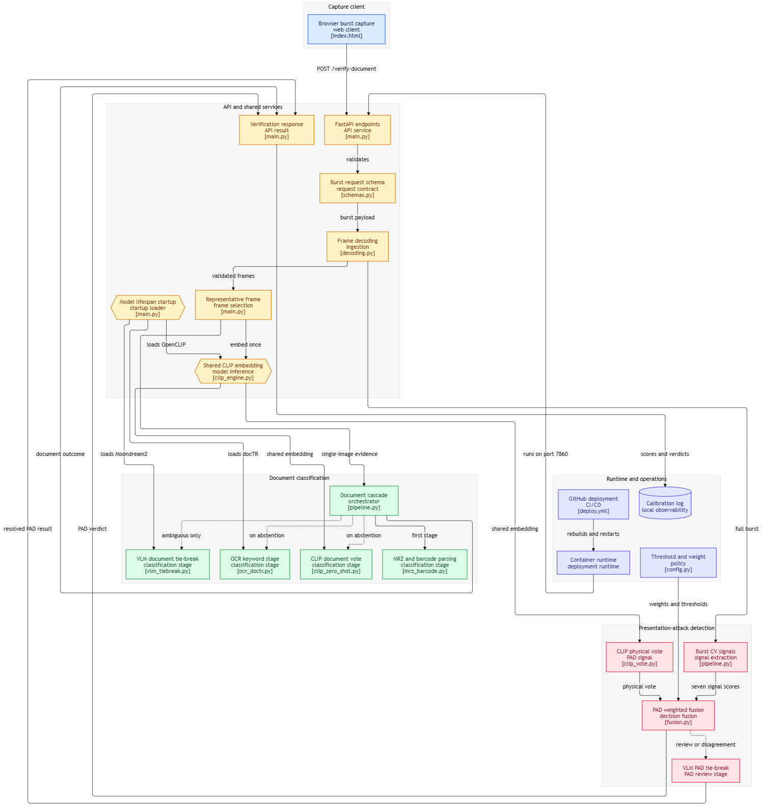

# ID Document Verification — Document Type + Presentation Attack Detection

A FastAPI service that takes a short webcam burst of someone holding up an ID document and answers two questions at once:

1. **What type of document is it?** (passport, driver's license, national ID, or open-ended "other") — with no fixed/closed class list.
2. **Is it real?** i.e. **Presentation Attack Detection (PAD)** — is the camera looking at a physical document, or a photo/screen recapture of one held up to fake it.

No custom-trained models and no dataset-building required to get started — everything runs on pretrained open-source weights (OpenCLIP, docTR, Moondream2) plus classical computer vision, fused together with an explicit **"don't guess, escalate to human review"** policy for anything ambiguous.

The service is containerized (`Dockerfile`) and has a GitHub Actions pipeline (`.github/workflows/deploy.yml`) that auto-deploys to a server on every push to `main`.

---

## 1. Design philosophy: cascade from cheapest+most-certain to slowest+most-flexible

This mirrors how production KYC systems (Onfido/Jumio/Veriff-style) are actually built: run deterministic checks first, spend ML only where nothing deterministic exists, and always allow the system to abstain to manual review rather than force a wrong answer under uncertainty.

**Document type** resolves through up to 4 layers, each a fallback for the one above:

| Layer | Method | Certainty | Speed |
|---|---|---|---|
| 0 | MRZ (`passporteye`) + PDF417 barcode (`zxing-cpp`) | Near-deterministic, checksum-validated | ~50-150ms |
| 1 | OCR keyword match (`docTR`) | Heuristic but strong | ~100-300ms |
| 2 | CLIP zero-shot (`open_clip`, `ViT-B-32` / `laion2b_s34b_b79k`) | Open-vocabulary | ~30-80ms (GPU) |
| 3 | Moondream2 VLM free-text tie-break | Rare fallback | ~1-2s |

**Presentation attack detection** fuses 7 independent classical CV signals (weighted sum) plus a CLIP zero-shot secondary vote, escalating to the same VLM only when genuinely ambiguous. This is deliberately an interpretable weighted fusion, not a single trained classifier — every verdict comes with which signals fired and why, it needs no labeled screen-recapture dataset to bootstrap, and it generalizes across phone/monitor models a narrow CNN wouldn't have seen.

---

## 2. Architecture



### Module map

| Path | Responsibility |
|---|---|
| `main.py` | FastAPI app with startup `lifespan` that **eager-loads all three models**, single `POST /verify-document` endpoint, `GET /health` |
| `config.py` | Every threshold/weight/model name — the only file you touch when calibrating |
| `schemas.py` | Pydantic request/response contracts |
| `doc_classification/mrz_barcode.py` | Layer 0 — deterministic MRZ + AAMVA barcode parsing |
| `doc_classification/ocr_doctr.py` | Layer 1 — docTR OCR keyword matching, exposes `_get_model()` for eager-loading |
| `doc_classification/clip_zero_shot.py` | Layer 2 — open-vocabulary CLIP zero-shot classification |
| `doc_classification/vlm_tiebreak.py` | Layer 3 — Moondream2 free-text fallback, exposes `_get_model()` for eager-loading |
| `doc_classification/pipeline.py` | Cascades layers 0→3, picks the sharpest frame for OCR/MRZ |
| `pad_detection/flash_challenge.py` | Signal: correlates brightness change with the client's own screen-flash pulse |
| `pad_detection/bezel_geometry.py` | Signal: Hough-line search for a second bezel edge around the document |
| `pad_detection/specular_reflection.py` | Signal: glare sharpness/size (glass vs. paper/PVC) |
| `pad_detection/color_whitepoint.py` | Signal: color temperature/saturation (emissive display vs. reflected light) |
| `pad_detection/micro_parallax.py` | Signal: Lucas-Kanade optical flow + planar-homography residual |
| `pad_detection/moire_fft.py` | Signal: FFT moire detection (low weight, bonus only) |
| `pad_detection/texture_lbp.py` | Signal: LBP texture uniformity (low weight) |
| `pad_detection/clip_vote.py` | CLIP zero-shot secondary vote (reuses the shared embedding) |
| `pad_detection/vlm_pad_tiebreak.py` | Wraps the shared Moondream2 model for the PAD ambiguous case |
| `pad_detection/fusion.py` | Weighted fusion, escalation logic, PASS/FAIL/MANUAL_REVIEW decision bands |
| `pad_detection/pipeline.py` | Orchestrates all 7 signals + CLIP vote + optional VLM tie-break |
| `utils/decoding.py` | Base64 → burst frames, strict error handling, resolution consistency check |
| `utils/clip_engine.py` | Shared OpenCLIP loader/embedder, exposes `_get_model()` for eager-loading |
| `utils/timing.py` | Per-stage latency tracking, surfaced in the API response |
| `utils/logging_calibration.py` | Logs every raw signal score + verdict to CSV per request (now gitignored) |
| `calibration/review_calibration.py` | Compares signal score separation between known-physical vs. known-screen sessions |
| `static/index.html` | Standalone webcam burst-capture test page (fires the flash pulse client-side) |
| `Dockerfile` | Builds a `python:3.10-slim` image, installs `tesseract-ocr`/`libzbar0`/`libgl1`/`libglib2.0-0`, runs as non-root, serves on port `7860` |
| `.github/workflows/deploy.yml` | On push to `main`: SSH into the server, `git pull`, rebuild the Docker image, restart the container |
| `.gitignore` | Excludes venvs, `.env`, `calibration/*.csv`, model weight files, and the repomix packed-output XML itself |

---

## 3. How a request flows through the system

0. **On server startup**, `main.py`'s FastAPI `lifespan` eager-loads OpenCLIP, docTR, and Moondream2 into memory *before* the app starts accepting traffic — trading slower startup for a fast, predictable first request (no more "first ambiguous request pays the VLM's cold-load cost").
1. **Client** captures a burst (`MIN_BURST_FRAMES=8` to `MAX_BURST_FRAMES=40`) via `static/index.html`, firing a brief white→off flash on its own screen partway through and labeling each frame's `screen_flash_state`.
2. **`POST /verify-document`** decodes and validates the burst (consistent resolution enforced), then picks the **sharpest frame** (highest Laplacian variance) as the `representative_frame` used everywhere a single frame is needed.
3. A **single CLIP embedding** is computed on that representative frame and shared between document-type classification (layer 2) and the PAD CLIP vote.
4. **Document type** cascades through layers 0→3, stopping at the first confident layer.
5. **PAD** runs all 7 classical signals, fuses them into a `classical_fusion_score` (missing/unfired signals contribute a neutral 0.5), blends in the CLIP vote at 20% weight, and — only if still ambiguous or the two sub-scores disagree by >0.35 — escalates once to the VLM tie-break.
6. Final PAD verdict is banded: `fused_score >= 0.68 → physical`, `<= 0.37 → screen_recapture`, otherwise `manual_review`. **Never a forced guess.**
7. Every raw signal score, the fused score, verdict, and doc type are appended to a local `calibration/*.csv` log for later threshold tuning (git-ignored, so it never leaves your machine/server by accident).
8. Response returns both results plus per-stage timing in milliseconds.

---

## 4. API

### `POST /verify-document`

Request:
```json
{
  "session_id": "optional-client-supplied-id",
  "frames": [
    { "image_b64": "<base64 JPEG/PNG, data-URI prefix optional>", "timestamp_ms": 0, "screen_flash_state": "off" },
    { "image_b64": "...", "timestamp_ms": 110, "screen_flash_state": "white" }
  ]
}
```
- `frames` must contain between `MIN_BURST_FRAMES` (8) and `MAX_BURST_FRAMES` (40) entries.
- `screen_flash_state` is `"off" | "white" | "unknown"`. If `config.FLASH_CHALLENGE_REQUIRED` is `True`, the request is rejected with a `400` unless both a `"white"` and an `"off"` labeled frame are present.

Response:
```json
{
  "session_id": "094e0087-e620-49ac-81e9-54ebc7de3145",
  "document": {
    "document_type": "national_id",
    "confidence": 0.8048,
    "source_layer": "clip_zero_shot",
    "raw_fields": { "all_scores": { "...": "..." } }
  },
  "presentation": {
    "verdict": "physical",
    "fused_score": 0.7748,
    "signals": [
      { "name": "flash_challenge", "score": 0.5137, "weight": 0.30, "fired": true, "detail": "..." },
      { "name": "bezel_geometry", "score": 0.8, "weight": 0.10, "fired": true, "detail": "..." }
    ],
    "clip_vote_score": 0.9999,
    "vlm_used": false,
    "vlm_reasoning": null
  },
  "stage_timings_ms": { "decode_burst": 4.1, "clip_embed_shared": 22.7, "...": "...", "total": 310.5 }
}
```

### `GET /health`
Returns `{"status": "ok"}`.

### `GET /static/index.html`
The webcam burst-capture demo page. Records the burst, fires the flash pulse, and posts to `/verify-document`.

---

## 5. Local setup & running it

### 5.1 Clone the repository
```bash
git clone https://github.com/AKPranav1/physical-vs-screen-id.git
cd physical-vs-screen-id
```

### 5.2 System packages (required for Layer 0 — MRZ/barcode)

These give `passporteye` (MRZ) and `pyzbar`/`zxing-cpp` (barcode) a real OCR/decoding backend. Skipping this step doesn't break the app — layer 0 just silently returns `None` and every document falls through to OCR/CLIP instead, so treat this as recommended, not mandatory.

**Linux (Debian/Ubuntu):**
```bash
sudo apt update
sudo apt install -y tesseract-ocr libzbar0
```

**macOS (Homebrew):**
```bash
brew install tesseract zbar
```

**Windows:**
Install Tesseract via the [UB-Mannheim installer](https://github.com/UB-Mannheim/tesseract/wiki). `config.py` auto-detects the default install path (`C:\Program Files\Tesseract-OCR\tesseract.exe`) automatically — no manual PATH edits needed if you installed to the default location. `libzbar`/`zxing-cpp` ships as a self-contained wheel on Windows via pip, so no separate system install is needed for barcode decoding.

### 5.3 Create a virtual environment and install dependencies

**macOS / Linux:**
```bash
python3 -m venv venv
source venv/bin/activate
pip install -r requirements.txt
```

**Windows (cmd or PowerShell):**
```powershell
python -m venv venv
venv\Scripts\activate
pip install -r requirements.txt
```

On first run, OpenCLIP, docTR, and the VLM each auto-download their pretrained weights (a few GB total: CLIP ViT-B/32 is small, docTR's models are moderate, Moondream2 is ~3.7GB in fp16). All open-weight — no API keys required. This download happens identically on all three platforms; just make sure you have a stable connection and a few GB of free disk on first launch.

By default the app tries `DEVICE=cuda` (env var `ID_VERIFY_DEVICE`) and falls back to CPU automatically if no GPU is available; expect the VLM and CLIP to be substantially slower on CPU, and expect **startup itself** to take noticeably longer now that all three models load eagerly instead of on first request. GPU acceleration via `torch`/CUDA is supported on Linux and Windows; on macOS, `torch` will run on CPU (or MPS if you separately configure it — not wired up by `config.py` by default).

### 5.4 Run the server

Same command on every platform, once the virtual environment is active:
```bash
uvicorn main:app --reload --host 0.0.0.0 --port 8000
```
Wait for `All models pre-loaded and ready!` in the console before testing — the server won't serve traffic until the lifespan startup hook finishes loading OpenCLIP, docTR, and Moondream2.

Then open `http://localhost:8000/static/index.html`, grant webcam permissions, and click **Capture Burst**. The JSON result (doc type + PAD verdict + full signal breakdown) renders directly on the page.

---

## 6. Presentation-attack signal weights at a glance

| Signal | Weight | Why |
|---|---|---|
| `flash_challenge` | 0.30 | Strongest, PPI-independent — a physical document reflects the client's own screen-flash pulse; a screen-in-frame has its own backlight and doesn't correlate the same way |
| `bezel_geometry` | 0.10 | Purely geometric second-edge (device bezel) detection via Hough lines |
| `specular_reflection` | 0.15 | Glass produces small sharp glare; paper/PVC produces broader, softer highlights |
| `color_whitepoint` | 0.12 | Emissive displays run cooler/more saturated than reflected indoor light |
| `micro_parallax` | 0.13 | Optical-flow planarity residual — real 3D relief moves non-uniformly under hand tremor; a flat recapture doesn't. Supporting signal only |
| `moire_fft` | 0.15 | FFT interference-pattern detection — intentionally not top-weighted; modern high-PPI phone screens at normal distance often don't alias into visible moire |
| `texture_lbp` | 0.05 | Low-weight bonus signal, LBP texture uniformity |

A signal that lacks enough evidence to fire contributes at **neutral (0.5)**, never a confident 0 or 1 — this stops a missing signal from silently dragging the fused score toward the wrong verdict.

---

## 7. Calibration (no dataset needed — just your own test captures)

Every request appends its raw signal scores, `fused_score`, verdict, and doc-type result to `calibration/*.csv` (git-ignored — this data is local/server-only and never committed). To (re)calibrate against your own hardware/lighting:

1. Run ~10-15 genuine physical-document captures through the UI, noting the returned `session_id`s.
2. Run ~10-15 deliberate screen-recapture attempts (hold a phone showing a photo of an ID up to the webcam) the same way.
3. ```bash
   python calibration/review_calibration.py \
     --known-physical-sessions <id1>,<id2>,... \
     --known-screen-sessions <id3>,<id4>,...
   ```
   This prints per-signal mean separation between the two groups.
4. Signals with weak separation → lower their weight in `config.PAD_SIGNAL_WEIGHTS`; signals with strong, consistent separation → raise it. Adjust `PAD_PASS_THRESHOLD` / `PAD_FAIL_THRESHOLD` based on where the two groups' `fused_score` distributions actually land.

This is calibration (tuning a handful of numbers against your own reference captures), not dataset-building or model training. Since `calibration/*.csv` is git-ignored, back up the file yourself before wiping a container/environment if you want to keep accumulated calibration data.

---

## 8. Docker & deployment

### Build and run locally
```bash
docker build -t id-verify-api .
docker run -d --name id-verify-container -p 7860:7860 id-verify-api
```
The `Dockerfile` uses `python:3.10-slim`, installs `tesseract-ocr`, `libzbar0`, `libgl1`, and `libglib2.0-0` (required by OpenCV/MRZ/barcode), runs the app as a non-root user (`uid 1000`, matching Hugging Face Spaces conventions), and serves on **port 7860** — not 8000 like the local `uvicorn` command above.

**Recommended: mount a persistent cache** so the container doesn't re-download gigabytes of model weights on every restart:
```bash
docker run -d --name id-verify-container -p 7860:7860 \
  -v ~/.cache/huggingface:/home/user/.cache/huggingface \
  id-verify-api
```

### Continuous deployment (GitHub Actions)
`.github/workflows/deploy.yml` runs on every push to `main`: it SSHes into the target server, `git pull`s the latest code, rebuilds the Docker image, stops/removes the old container, and starts a fresh one on port 7860.

To activate it, add these repository secrets under **Settings → Secrets and variables → Actions**:

| Secret | Purpose |
|---|---|
| `SERVER_HOST` | Public IP of the target server |
| `SERVER_USERNAME` | SSH username (e.g. `ubuntu`) |
| `SERVER_SSH_KEY` | Private SSH key for server access |

The server must already have the repo cloned at `~/physical-vs-screen-id` before the first automated deploy — the workflow only pulls, it doesn't clone. Until the secrets are added, this workflow will fail on push by design.

### Hardware requirements
Provision the server with **at least 8 GB RAM**. Because models are now eager-loaded at startup (see Section 3, step 0) rather than lazily on first use, Moondream2 alone permanently occupies roughly 3.7 GB for the lifetime of the process, on top of OpenCLIP and docTR.

---

## 9. Honest limitations

- **`micro_parallax`** can be suppressed by a very steady hand or a propped-up phone — a supporting signal only, never decisive alone.
- **`moire_fft`** frequently shows nothing on modern high-PPI phone screens at normal capture distance — expected, by design low-weight.
- **`flash_challenge`** depends on the client actually rendering the flash pulse and correctly labeling `screen_flash_state`; if it can't, this signal reports "not fired" and the system leans on the other six.
- **Layer 0 (MRZ/barcode)** requires `tesseract-ocr` and `libzbar`/`zbar` system packages (package name and install method differ by OS — see Section 5.2); without them it returns `None` and the cascade falls through, still working but without the deterministic fast path.
- **macOS** isn't part of the tested deployment path (the `Dockerfile` and CI/CD pipeline target Linux only) — it works for local development, but `torch` runs CPU-only there by default, so expect noticeably slower CLIP/VLM inference than on a CUDA-capable Linux/Windows machine.
- All thresholds in `config.py` are reasonable starting points, **not final** — run the calibration pass in Section 7 against your own webcam/lighting setup before trusting this in a real verification flow.
- **Startup is now slower** than in earlier builds, since all three models load eagerly before the app accepts any traffic — this is a deliberate trade for consistent per-request latency, not a bug. If you need fast cold starts (e.g. serverless), consider reverting to the previous lazy-load pattern.
- The CI/CD pipeline assumes a long-lived server reachable over SSH; it does not itself provision infrastructure, rotate secrets, or roll back a failed deploy.